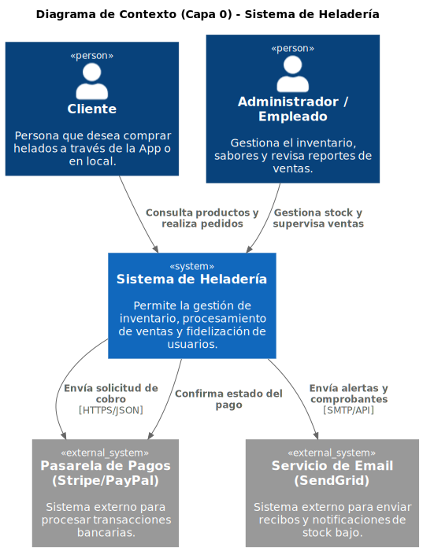

# heladosBackend

Ejemplo practico de un Backend de helados aplicando DDD y Patron Hexagonal

El sistema se debe encargar de 

Rquerimientos del dominio

* Manejo de usuarios:
  * Se pueden gestionar los distintos usuarios  que van a usar el sistema con sus respectivos roles definidos
    * cliente
    * empleado
    * administrador

[Sub Dominios](./Dominios/Sub%20Dominios.md) 

